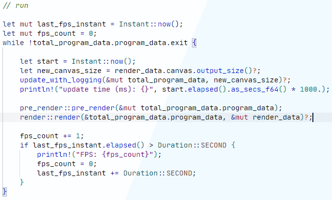
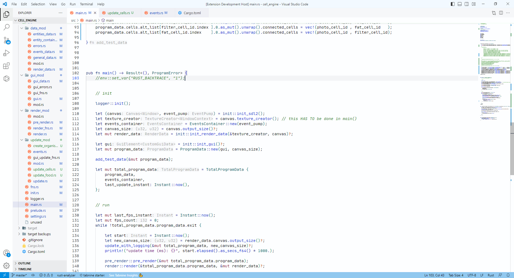

<br>

<h1 align="center">What42's Rust Theme (Light)</h1>

<p align="center">
	&nbsp;
	<b comment='
	&nbsp;
	'></b>
	&nbsp;
	
</p>

<h3 align="center" style="font-weight: bold;">This is my personal VS Code theme, focused mainly on readability. It was originally inspired by / made because of <a href="https://www.youtube.com/@_codestyle">CodeStyle's</a> videos</p>

<h3 align="left" comment="this is needed to stop the image from being centered"></h3>

<br>



### These images use [JetBrains Mono](https://www.jetbrains.com/lp/mono/) and [Material Icons](https://marketplace.visualstudio.com/items?itemName=PKief.material-icon-theme)

<br>
<br>

# Goals of this theme:

### Readability
  - **Text should be dark and should contrast against the background**
### Pleasantness
  - **I want it to just look as nice as possible**
### Bring attention to the right things
  - **If it isn't important, it shouldn't stand out**
  - **If it's possibly bad (mut, self, etc), it should stand out as bad**

<br>
<br>

# Entire screen example:



<br>
<br>

## Supported languages:

- **Rust**
- **Lua**
- **Glsl**
- **JSON**
- **Toml**
- **Markdown**

<br>

## Links:

- **[Changelog](CHANGELOG.md)**
- **[Marketplace](https://marketplace.visualstudio.com/items?itemName=What42Pizza.what42s-rust-theme-light)**
- **[GitHub](https://github.com/What42Pizza/What42s-Rust-Theme_Light)**

<br>

Unfortunately, I don't think I can change the color of 'unsafe' without sacrificing other coloring abilities, but hopefully that will change sometime soon.

If you want an alternate theme that colors 'unsafe', you can open an issue and I'll start working on it if I have the time (or you can make it yourself, this is under an MIT license).

<br>
<br>
<br>

# Additional customizations:

## Suggested settings:

``` json
{
	"terminal.integrated.minimumContrastRatio": 2.5, // lower is more colorful, higher is easier to read
	"files.autoSave": "afterDelay",
	"editor.acceptSuggestionOnEnter": "off",
	"editor.lightbulb.enabled": false,
	"editor.insertSpaces": false,  // use tabs instead of spaces
	"editor.detectIndentation": false,
	"editor.cursorBlinking": "solid",
	"editor.fontSize": 14.5,
	"editor.letterSpacing": 0.1,
	"editor.lineHeight": 1.3,
	"editor.padding.top": 8,
	"editor.fontLigatures": true,
	"workbench.tree.indent": 10,
	"editor.comments.insertSpace": false,
	"terminal.integrated.smoothScrolling": true,
	"workbench.list.smoothScrolling": true,
	"terminal.integrated.smoothScrolling": true,
}
```

<br>

## Color override settings:

``` json
{
	"workbench.colorCustomizations": {},
	"editor.tokenColorCustomizations": {},
	"editor.semanticHighlighting.enabled": true,
	"editor.semanticTokenColorCustomizations": {},
}
```

<br>

## Additional programs:

- **[f.lux](https://justgetflux.com/)** (darkens screen at night)

<br>
<br>

## Other themes to check out:

- **[Amethyst Themes](https://marketplace.visualstudio.com/items?itemName=amodio.amethyst-theme)** (dark)
- **[MagicUser](https://marketplace.visualstudio.com/items?itemName=BernardoPires.magicuser-color-themes)** (dark and light)
- **[Kary Pro Colors](https://marketplace.visualstudio.com/items?itemName=karyfoundation.theme-karyfoundaion-themes)** (dark and light)
- **[Cerulean](https://marketplace.visualstudio.com/items?itemName=OwenWilliams.cerulean)** (dark and light)
- **[Lightning](https://marketplace.visualstudio.com/items?itemName=zevross.lightning)** (dark and light)
- **[Mimesis](https://marketplace.visualstudio.com/items?itemName=AlexanderDyriavin.mimesis)** (light)

<br>
<br>
<br>

### **I can't guarantee that I'll support other languages and/or take fixes or suggestions, but it's not impossible**

<br>

## License

This project is under the [MIT License](LICENSE)
